# Full Installation Guide

⚠️  70% complete - WORK IN PROGRESS ⚠️

## Steps

### 1. Fork this repository

1. Log into GitHub.

2. Navigate to the [main Contrails page](https://github.com/jcsalterego/contrails) and click the Fork button.

3. Proceed with instructions until your GitHub user has a fork of Contrails.

### 2. Create Cloudflare API Token

_These instructions are an excerpt from [Running Wrangler in CI/CD](https://developers.cloudflare.com/workers/wrangler/ci-cd/)._

1. Log in to the [Cloudflare dashboard](https://dash.cloudflare.com/).
At the top-right, navigate to [My Profile](https://dash.cloudflare.com/profile), and then [API Tokens](https://dash.cloudflare.com/profile/api-tokens). Click on **Create Token**.

2. Select **Use template** next to **Edit Cloudflare Workers**.

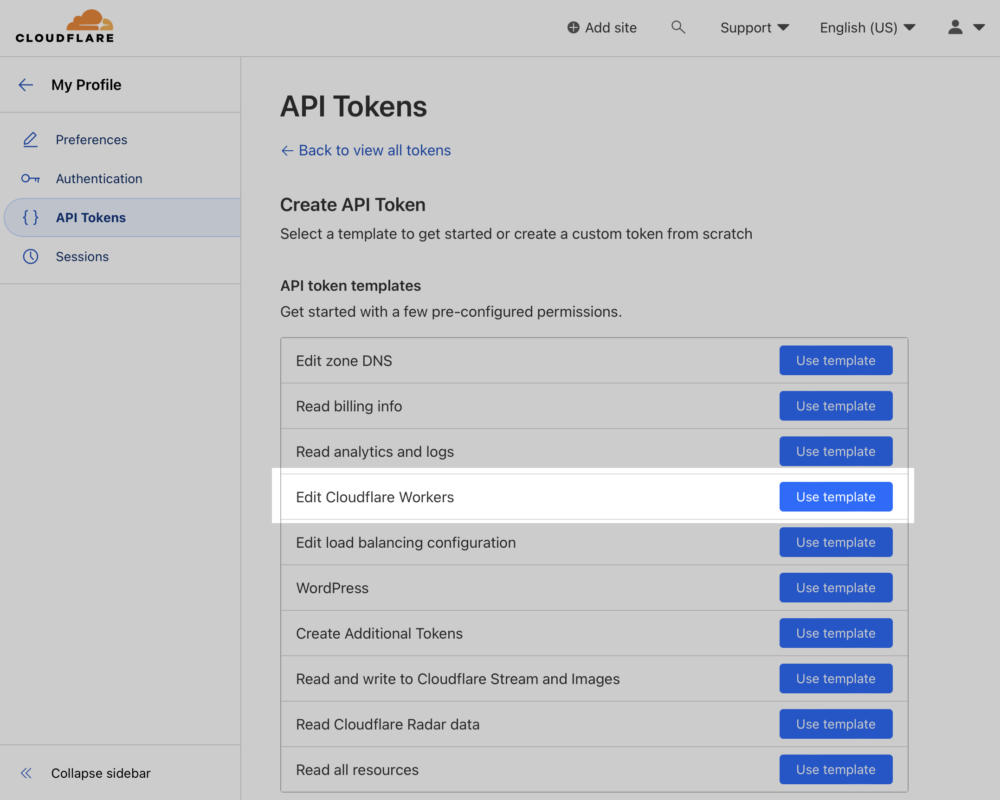

3. Set the Account Resources. If this Cloudflare account is only for this project, you can choose "All accounts" and "All zones."

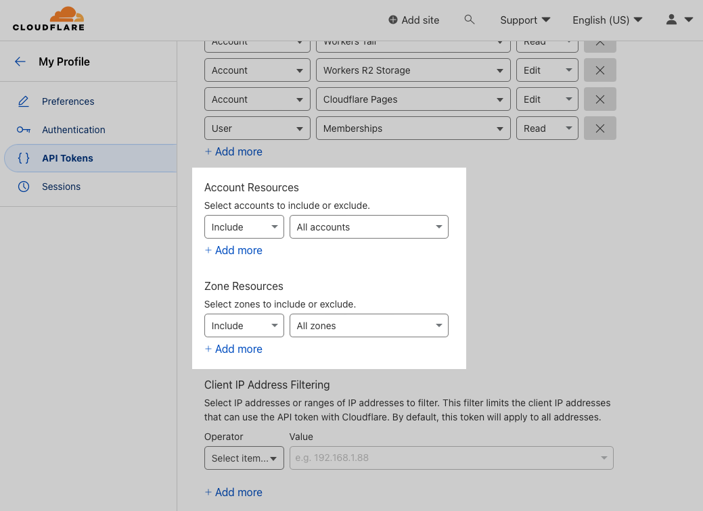

4. Click on **Continue to summary**.

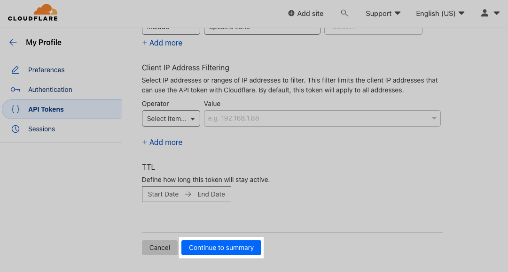

5. Click on **Create Token**.

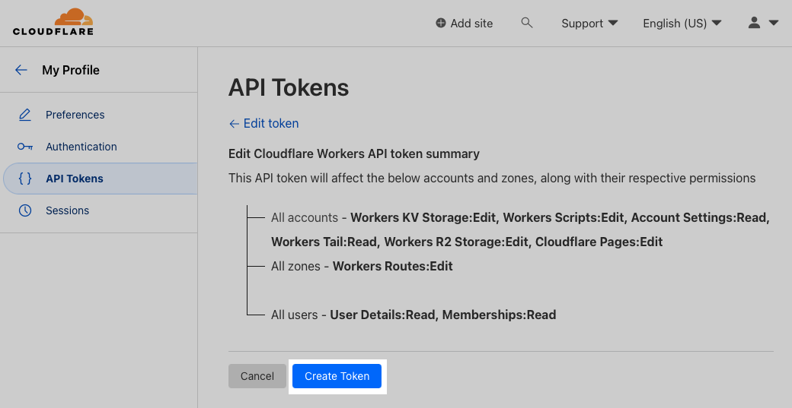

6. Copy and save the token, as you will need it in the next step.

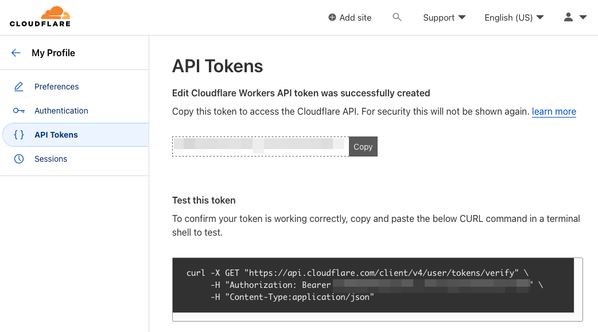

### 3. Save Cloudflare API Token to Repository Secrets

In your GitHub repository, go to `Settings > Secrets and variables > Actions`.

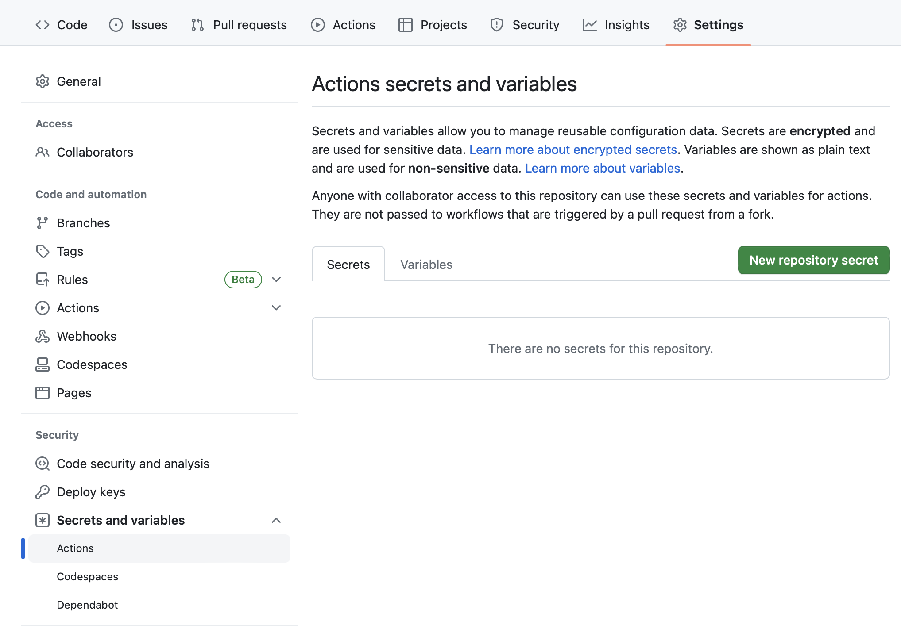

Click on **New repository secret**, and add `CLOUDFLARE_API_TOKEN`.

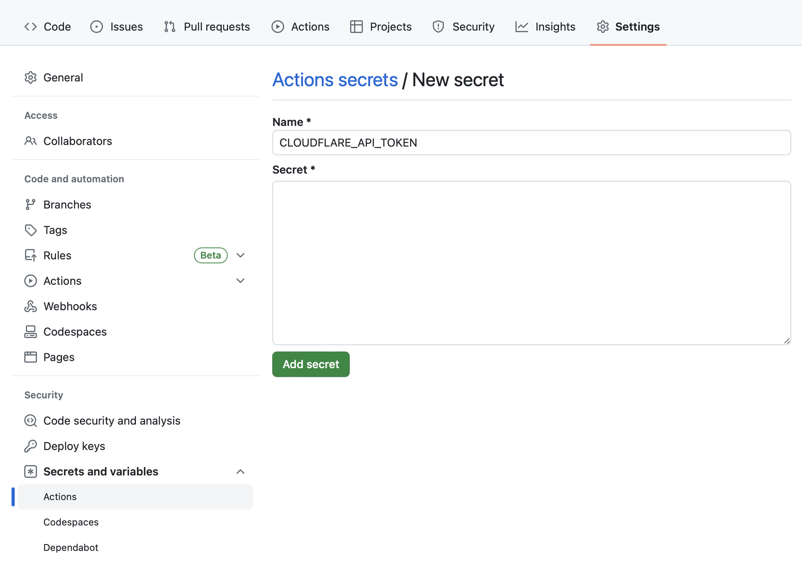

### 4. Create Cloudflare Application

1. Go to `Cloudflare Dashboard > Workers & Pages`.

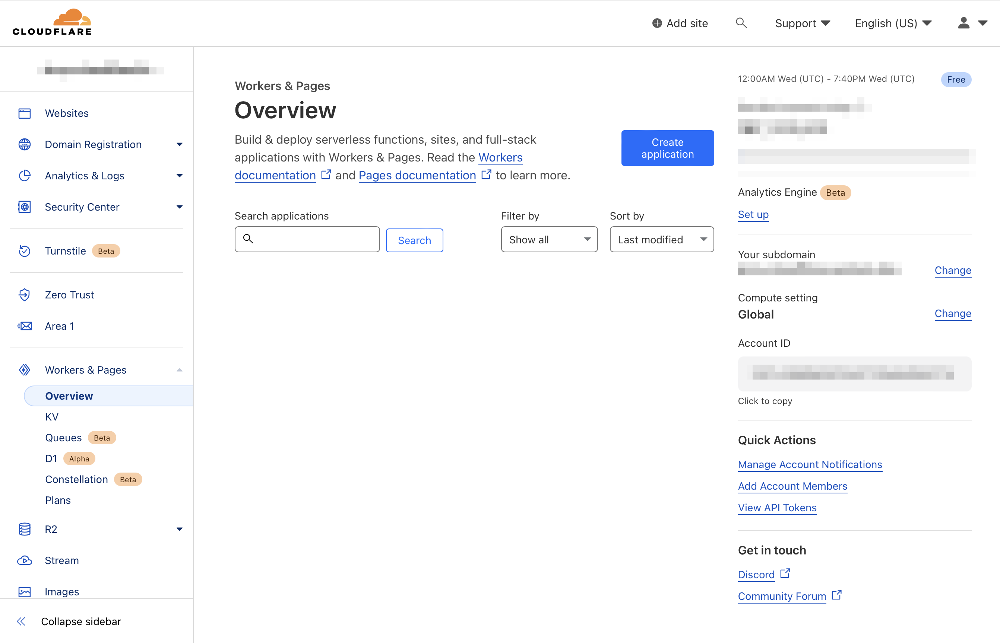

2. Click on **Create Application**.

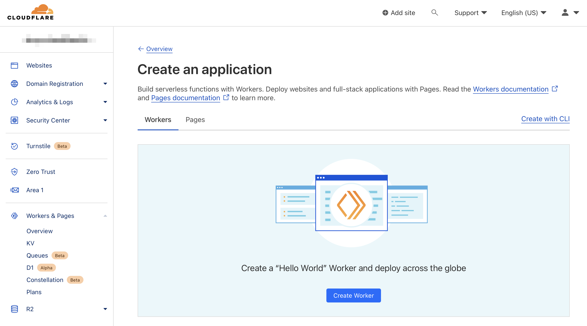

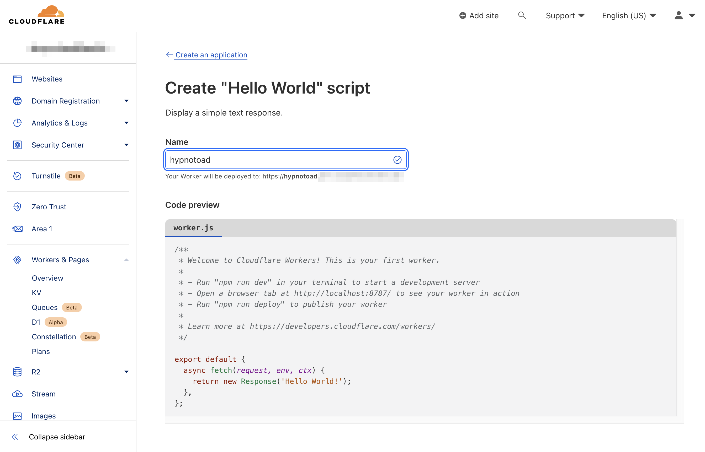

Click Deploy

3. set `CLOUDFLARE_WORKER_NAME`

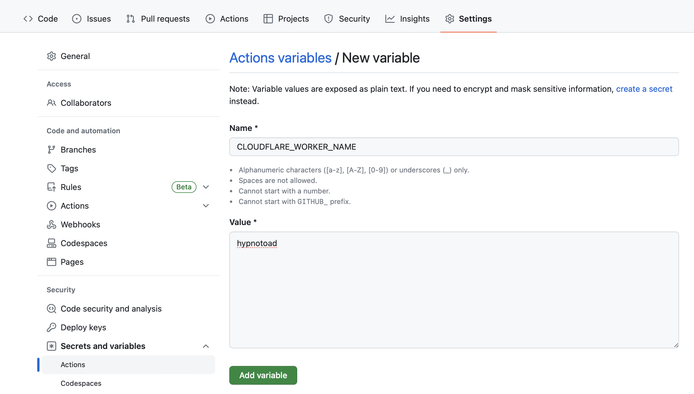

4. set CLOUDFLARE_ACCOUNT_ID

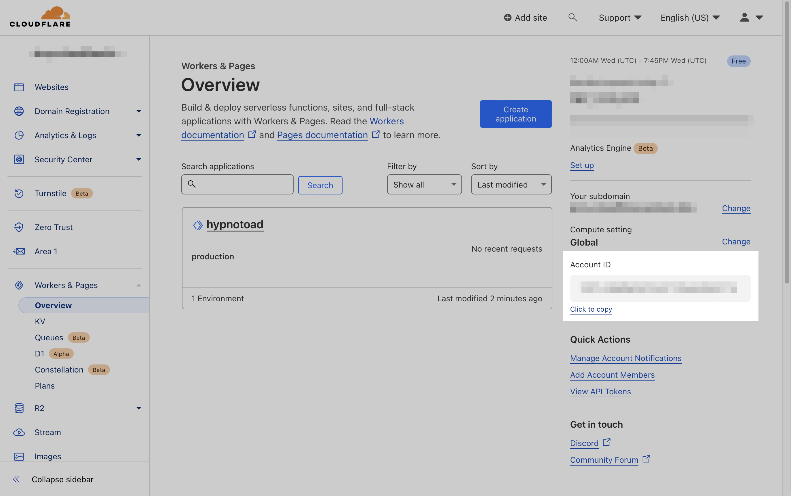

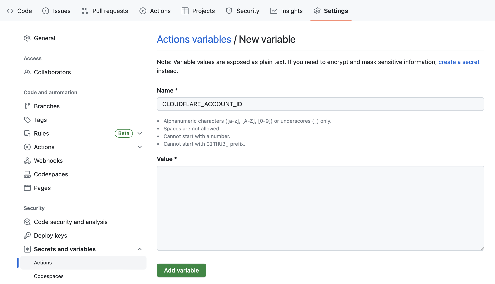

