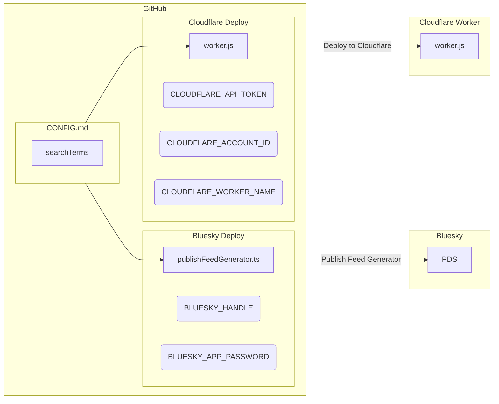
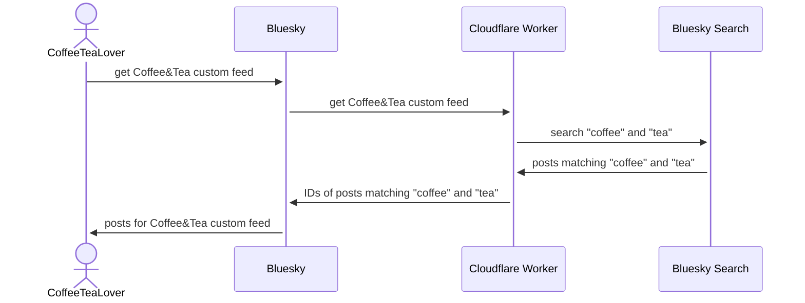

# Contrails

Contrails is an [ATProto Feed Generator](https://github.com/bluesky-social/feed-generator) backed by
[Cloudflare Workers](https://workers.cloudflare.com) and Bluesky Search.

Edit `CONFIG.md` to define your feed generator.

Deploy right from [GitHub Actions](https://github.com/features/actions).

## A Post

_[Holds hand to earpiece]_ I'm being told Bluesky Search is now called [Palomar](https://github.com/bluesky-social/indigo/tree/main/cmd/palomar). RIP thecloud, we hardly knew ye.

## Requirements

- Bluesky Social account
- GitHub account ([Sign up](https://github.com/signup) or [Login](https://github.com/login))
- Cloudflare account ([Sign up](https://dash.cloudflare.com/sign-up) or [Login](https://dash.cloudflare.com/login/))
- A moderate-to-high tolerance for adventure

## Installation & Configuration: The Short Version

1. Create a Cloudflare Worker
2. Create a Cloudflare API Token (the Edit Workers template is fine)
3. Create a Bluesky App Password
4. Fork this repository
5. In your fork's **Settings > Secrets and variables > Actions**, set the following:
  * Variable: `BLUESKY_HANDLE`
  * Variable: `CLOUDFLARE_ACCOUNT_ID`
  * Variable: `CLOUDFLARE_WORKER_NAME`
  * Secret: `BLUESKY_APP_PASSWORD`
  * Secret: `CLOUDFLARE_API_TOKEN`
6. Edit [CONFIG.md](CONFIG.md) in your fork
7. Go to **Actions** > **1. Check Requirements**, select **Run Workflow**, refresh and wait for completion
8. Go to **Actions** > **2. Deploy to Cloudflare**, select **Run Workflow**, refresh and wait for completion
9. Go to **Actions** > **3. Publish Feed Generator**, select **Run Workflow**, refresh and wait for completion

## Installation & Configuration: Director's Cut

Here is the currently incomplete, long unabridged version of Installation and Configuration:

[INSTALL.md](INSTALL.md) `under-construction.gif`

## Publishing Diagram

## Query Diagram

## LICENSE

[2-Clause BSD](LICENSE)
