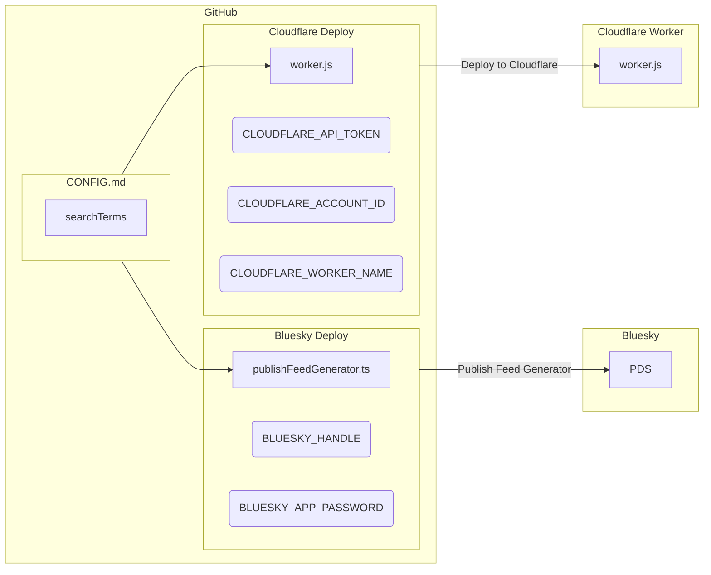
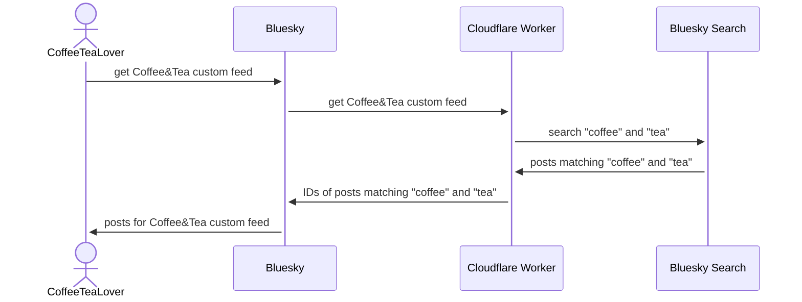

# Contrails

Contrails is an [ATProto Feed Generator](https://github.com/bluesky-social/feed-generator) backed by
[Cloudflare Workers](https://workers.cloudflare.com) and [Bluesky Search](https://bsky.app/search).

Fork or copy the repository and edit `CONFIG.md` to define your feed generator.

Deploy right from [GitHub Actions](https://github.com/features/actions) to [Cloudflare Workers](https://workers.cloudflare.com).

The current release is [**0.2.1**](https://github.com/jcsalterego/Contrails/releases/latest).

## Requirements

- Bluesky Social account
- GitHub account ([Sign up](https://github.com/signup) or [Login](https://github.com/login))
- Cloudflare account ([Sign up](https://dash.cloudflare.com/sign-up) or [Login](https://dash.cloudflare.com/login/))
- A moderate-to-high tolerance for adventure

## Installation & Configuration: The Short Version

1. Create a Cloudflare Worker
2. Create a Cloudflare API Token (the Edit Workers template is fine)
3. Create a Bluesky App Password
4. Fork this repository
5. In your fork's **Settings > Secrets and variables > Actions**, set the following:
  * Variable: `BLUESKY_HANDLE`
  * Variable: `CLOUDFLARE_ACCOUNT_ID`
  * Variable: `CLOUDFLARE_WORKER_NAME`
  * Secret: `BLUESKY_APP_PASSWORD`
  * Secret: `CLOUDFLARE_API_TOKEN`
6. Edit [CONFIG.md](CONFIG.md) in your fork
7. Go to **Actions** > **1. Check Requirements**, select **Run Workflow**, refresh and wait for completion
8. Go to **Actions** > **2. Deploy to Cloudflare**, select **Run Workflow**, refresh and wait for completion
9. Go to **Actions** > **3. Publish Feed Generator**, select **Run Workflow**, refresh and wait for completion
10. Visit the `BLUESKY_HANDLE` profile, e.g. [https://bsky.app/profile/jcsalterego.bsky.social](https://bsky.app/profile/jcsalterego.bsky.social) and then the Feeds tab

The longer (and incomplete) instructions can be found in [INSTALL.md](INSTALL.md).

## Upgrading

The first step before any major upgrade is to make a copy of your markdown config file. Your best bet is to save it in a separate directory such as `backup_configs/`, or you will have to remember to set `isEnabled` to false so it doesn't get picked up as a live config!

In the event you'd like to pull in the latest changes into a fork of Contrails, GitHub has great documentation here:
[GitHub Docs: Syncing a fork](https://docs.github.com/en/pull-requests/collaborating-with-pull-requests/working-with-forks/syncing-a-fork)

## Changelog

### 0.2.1

* `+reposts` and `+replies` support. Note: Reposts will not be attributed ("reposted by User").

### 0.2.0

* Pagination
* Safe Mode

### 0.1.0

* New search term type: Users

### 0.0.4

* New search term type: Pinned posts

### 0.0.3

* Multiple feed support
* Ignore blockquotes in CONFIG.md (to allow comments).

### 0.0.2

* Delete Feed Generator workflow

### 0.0.1

* Initial Release

## Etymology

_Ed. Note: Bluesky Search is now called [Palomar](https://github.com/bluesky-social/indigo/tree/main/cmd/palomar)._

## Publishing Diagram

## Query Diagram

## LICENSE

[2-Clause BSD](LICENSE)
